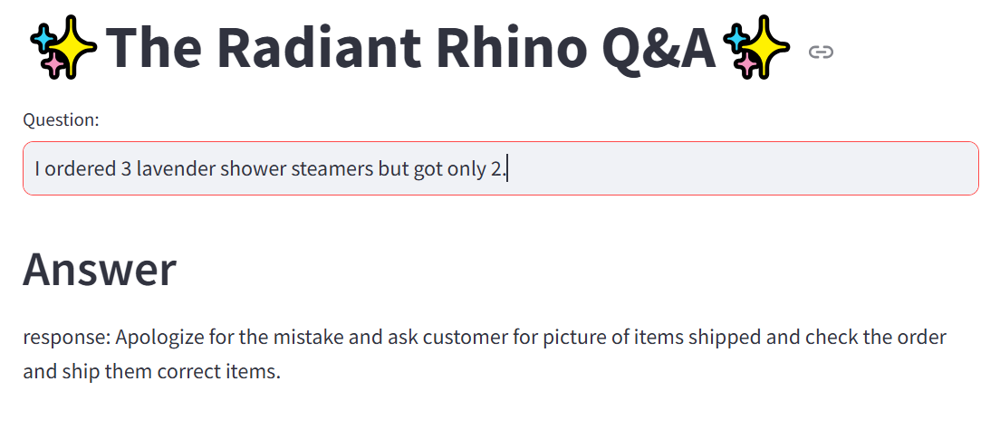

# The Radiant Rhino Question and Answer System Based on Open AI LLM and Langchain for a Personal Care Brand  

Built a Q&A system for a personal care brand called The Radiant Rhino which sells shower steamers. This system will provide a streamlit based user interface for the customer care representatives where they can ask questions and get answers to provide to customers.



## Project Highlights

- The question and answer system can reduce the workload of staff when looking for answers as it integrates both the CSV file of customer support FAQs and the LLM which assists with this task.

## Tools used
  - Langchain + Open AI: LLM based Q&A
  - Streamlit: UI
  - Huggingface instructor embeddings: Text embeddings
  - FAISS: Vector database

## Architecture Diagram


## Steps

1. Install the required dependencies using pip:

```bash
  pip install -r requirements.txt
```
2. Acquire an OpenAI api key and put it in .env file

```bash
  OPENAI_API_KEY="your_api_key_here"
```
3. Run the create_db.py file and once knowledge base is created you will see a directory called faiss_index in your current folder.


4. Run the Streamlit app by executing:
```bash
streamlit run main.py

```

5. The web app will open in your browser.


- Type your question in Question box and hit Enter

## Sample Questions/Queries
  - Your customer care is fantastic!
  - I want my order shipped to my daughter's address: XYZ. I have placed the order using my address.
  - I ordered lavender shower steamers but I got orange shower steamers.
  - USPS delivered my package but it was stolen from my door.
  - My card was declined on your website.
  - What are your shipping timelines?
  - What is your return and exchange policy?

## Project Structure

- main.py: The main Streamlit application script.
- create_db.py: This code creates the vector database.
- requirements.txt: A list of required packages for the project.
- .env: Configuration file for storing your OpenAI API key."# Knowledge-base-Q-A-system" 
